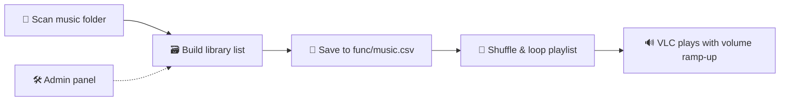

<div align="center">

# 🎵 Music Mixer

**A stylish, terminal-based music player for building and enjoying your personal library.**


</div>

---

## 📖 Table of Contents

- [What This Project Does](#-what-this-project-does)
- [Core Features](#-core-features)
- [Tech Stack](#-tech-stack)
- [Project Structure](#-project-structure)
- [Main Files](#-main-files)
- [Getting Started](#-getting-started)
- [How It Works](#-how-it-works)
- [Library Management](#-library-management)
- [Current Capabilities](#-current-capabilities)
- [Roadmap](#-roadmap)
- [Testing](#-testing)
- [Summary](#-summary)

---

## 🎧 What This Project Does

Music Mixer is designed for people who want a simple home music experience with a few useful controls:

| | |
|---|---|
| 📁 | Add songs to a local music folder |
| 🗃️ | Automatically track and organize files in a CSV library |
| 🔀 | Shuffle songs in a loop for continuous playback |
| 🛠️ | Manage the library with an admin panel |
| 🖥️ | View the music collection from the terminal UI |
| 🔊 | Play tracks using VLC with a strong max-volume startup flow |

## ✨ Core Features

- **Smart playlist generation** from the local `music` folder
- **CSV-backed music library** tracking
- **Randomized playback loop**
- **Admin panel** for adding and deleting songs
- **Library listing** with metadata like name, size, and location
- **Easy startup** through the launcher and main menu
- **Playback volume ramping** for a clean, loud listening experience

## 🧰 Tech Stack

| Component | Technology |
|---|---|
| Language | Python |
| Media Playback | VLC (via `python-vlc`) |
| Data Storage | CSV |
| Interface | Terminal / CLI |
| Packaging | PyInstaller |
| Testing | pytest |

## 🧩 Project Structure

<details>
<summary>Click to expand the folder layout</summary>

```text
Music_mixer/
├── main.py                  # Terminal menu and app entry
├── music_launcher.py        # Launches the app in immediate-play mode
├── music.spec                # PyInstaller spec file for packaging
├── README.md                 # Project documentation
├── func/
│   ├── function.py           # Core music logic
│   └── music.csv              # Generated music catalog
├── music/                     # Actual music files
├── test/
│   └── test_music_player.py
├── build/
│   └── music/                  # PyInstaller build output
└── .gitignore                   # Project ignore rules (if present)
```

</details>

## 🔧 Main Files

<details open>
<summary><b><code>main.py</code></b> — Terminal menu and app entry</summary>
<br>

Handles the user menu and app flow:
- Play music
- Open admin panel
- Show library
- Exit the app

</details>

<details>
<summary><b><code>music_launcher.py</code></b> — Immediate playback launcher</summary>
<br>

Starts the app directly in play mode.

</details>

<details>
<summary><b><code>func/function.py</code></b> — Core app logic</summary>
<br>

Contains the real app logic:
- Scanning files
- Generating CSV entries
- Adding / removing music
- Playlist selection
- VLC playback control
- Volume management

</details>

<details>
<summary><b><code>func/music.csv</code></b> — Music catalog</summary>
<br>

Stores discovered song metadata in a structured table for easy management.

</details>

<details>
<summary><b><code>test/test_music_player.py</code></b> — Automated tests</summary>
<br>

Contains automated tests for music discovery, CSV updates, playback, and player lifecycle.

</details>

## 🚀 Getting Started

### 1️⃣ Install dependencies

Make sure Python is installed, then install VLC support:

```bash
py -m pip install python-vlc
```

### 2️⃣ Run the app

```bash
py main.py
```

Or start immediately in playback mode:

```bash
py music_launcher.py
```

## 🎮 How It Works



1. The app scans the `music` folder.
2. It creates a library list and saves it to `func/music.csv`.
3. You can play the shuffled playlist in a loop.
4. The admin panel helps add or remove songs.
5. VLC plays each track with a volume ramp-up for a cleaner startup.

## 🗂️ Library Management

The project supports:

- ✅ Viewing all songs in the library
- ➕ Adding `.mp3` files from your system
- ➖ Deleting tracks from the local `music` folder
- 🔄 Reindexing the CSV data automatically after changes

## ✅ Current Capabilities

- [x] Music discovery
- [x] Playlist looping
- [x] Random shuffle playback
- [x] CSV-based library tracking
- [x] Admin management tools
- [x] Safe playback stop and cleanup
- [x] Max-volume startup behavior

## 🛣️ Roadmap

Future improvements this app could grow into:

- [ ] A better visual interface with Tkinter or PyQt
- [ ] Album art support
- [ ] Song search and filtering
- [ ] Volume controls during playback
- [ ] Favorite and recently played lists
- [ ] Drag-and-drop library import
- [ ] Dark-mode terminal UI

## 🧪 Testing

Run tests with:

```bash
py -m pytest -q
```

These tests cover:

| Area | Covered |
|---|---|
| CSV generation | ✅ |
| Adding songs | ✅ |
| Playback flow | ✅ |
| Randomization | ✅ |
| Lifecycle cleanup | ✅ |

## 📌 Summary

Music Mixer is a compact yet capable music playback application that balances simplicity, organization, and automation. It turns a local folder of songs into a mini personal music library with shuffle, loop playback, and easy track management.

> 💡 **What's next?** This project can evolve into a richer desktop-style music app with a GUI, album covers, and a more polished user experience.

---

<div align="center">

If you find this project useful, consider giving it a ⭐

</div>